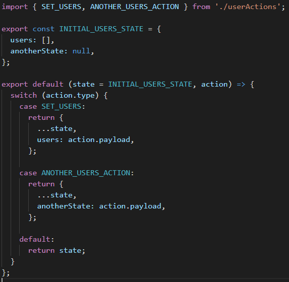

# Proposta estruturação aplicação React+Redux

**OBS.:** A proposta considera uma aplicação React utilizando redux e redux-thunk. Porém os conceitos propostos podem ser adaptados e utilizados com outros controladores de estado

Como você já deve saber, o React não é um framework, e sim, uma biblioteca para criar interfaces de usuário. Isso quer dizer que, o React em si não vai e nem tem a pretensão (até então) de definir como sua aplicação deve ser estruturada/organizada. Isso quer dizer também que, o React vai te dar maior liberdade para organizar sua aplicação da forma mais adequada às necessidades. Porém, parafraseando uncle Ben: *"com grandes poderes, vem grandes responsabilidades"*
Dito isso, este artigo não tem como propósito entregar uma receita de bolo definitiva de como organizar sua aplicação React, mas sim, propor algumas ideias.

## Por que aplicações React viram monstrinhos?
Bom, já que falamos de reponsabilidade, acredito que esse seja o cerne dos problemas de organização de uma aplicação React, separar as **reponsabilidades**. E isso é o que os frameworks como Angular, ao meu ver, fazem bem. O React é uma lib de UI com escopo de lidar com a renderização através dos **Componentes**. Porém, quando essa ideia não fica clara, acabamos trazendo para os componente várias outras responsabilidades
- componentes lidando diretamente com chamadas de APIs
- componentes tratando exceções
- componentes tendo que "entender"  regras de negócio
- componentes fazendo muita manipulação de dados
- componentes lidando diretamente com recursos do browser

O React é uma lib declarativa, isso quer dizer que quando construímos um componente, nós devemos preocupar mais com O QUE e deixar para o React lidar com o COMO renderizar. Seria bom se usássemos essa mesma abordagem - **O QUE/COMO** - para separarmos o que é responsabilidade do componente e o que não é, e assim mantermos nossos componentes o mais declarativos possível, não só na parte da renderização (já é abstraída pelo React). 
Para isso precisamos **separar responsabilidades** na nossa aplicação, começando pela estrutura de pastas.

## Objetivos

- **Melhorar performance da aplicação**
- **Reduzir tamanho do _bundle_ da aplicação**
- **Potencializar escalabilidade da aplicação**
- **Melhorar usabilidade da aplicação**
- **Melhorar organização de código**
- **Aumentar reuso de código**
- **Reduzir quantidade de testes unitários**
- **Facilitar e dimunuir tempo para manutenibilidade da aplicação**

## 1. Estrutura de pastas
Se você procurar na documentação oficial do React encontrará duas abordagens para estruturação de pastas: agrupamento por [arquivos de mesmo tipo](https://reactjs.org/docs/faq-structure.html#grouping-by-file-type) e agrupamento por [features](https://reactjs.org/docs/faq-structure.html#grouping-by-features-or-routes)
- Cenário: estrutura de pasta que agrupa arquivos por tipo

### 1.1 Estrutura de pastas - Arquivos mesmo tipo
- Isso quer dizer que existe pastas como: containers, components, actions, reducers
- Essas pastas contém arquivos de todos os contextos/funcionalidades do sistema


### 1.1 Estrutura de pastas - Problemas

- o número de arquivos por pasta cresce consideravelmente a medida que a aplicação evolui
- arquivos correlatos de uma mesma funcionalidade, que geralemente precisam ser modificados em conjunto, ficam muito distantes uns dos outros
- vários níveis de aninhamento de subpasta
  

    - dificulta encontrar o que precisamos
    - dificulta  transição entre arquivos e imports relativos
    - quando for realmente necessário aninhamento, não ultrapasse 3 níveis: [recomendação](https://reactjs.org/docs/faq-structure.html#is-there-a-recommended-way-to-structure-react-projects)

### 1.4 Estrutura de pastas - Proposta


- Agrupamento de arquivos por features
- Cada feature deve conter todos os arquivos correlatos
- Dentro da pasta da feature havera algumas subpastas e arquivos para separar resposabilidades. Porém não deve haver mais de 3 níveis:

### 1.4 Estrutura de pastas - Proposta - Responsabilidades
- **FeatureStore**
    - Path: ```src/Features/pastaFeature/store```
    - O nome Store é genérico, mas você pode chamar essa subpasta pelo nome da lib que estiver usando para controle de estado global. Ex. redux
    - Aqui vai todos os arquivos relacionados a controle de estado global da Feature: actions, operations, reducer.
    - ```store/nomeFeatureActions```: para actions síncronas que disparam um único dispatch
    - ```store/nomeFeatureOperations```: É possível que uma action dispare multiplos dispatches e/ou faça algo assíncrono. Por serem "actions epeciais",  vamos chama-las de Operations
    - ```store/nomeFeatureReducer```: É onde será feito a atualização de fato do estado Feature dado a ocorrência de alguma action
    Nos próximos pontos, quando mencionar Store, estarei me referindo a esses três arquivos.

- **FeatureHooks**
    - Path: ```src/Features/pastaFeature/hooks```
    - Pode ser que uma mesma lógica, que envolva uso de hooks do React ou de terceiros, seja útil em mais de um componente da Feature. Nesse caso extraia  a lógica para hooks customizados que serão usados somente no contexto da Feature

- **FeatureViews**
    - Path: ```src/Features/pastaFeature/views```
    - Aqui vai todos os arquivos referentes a renderização, ou seja, componentes da Feature.
    - A reponsabilidade do componente deve se conter na renderização. Deixe os demais arquivos da Feature lidarem com as complexidades de chamadas de APIs, regras de negócio, manipulação de dados, validações, etc.
    - Tente manter seu componente menos imperativo e mais declarativo
    - Use extensão ```.JSX``` para componentes

- **FeatureService**
    - Path: ```src/Features/pastaFeature/nomeFeatureService```
    - Responsável pela comunicação da **Feature** com mundo externo: chamadas à APIs, banco de dados local (no caso de aplicações PWA).
    - Abstrai dos **Componentes** e da **Store** a complexidade do **COMO** buscar/enviar dados

- **FeatureManager**
    - Path: src/Features/pastaFeature/nomeFeatureManager
    - Responsável por intermediar a comunicação de **Componentes** e **Store** com a **Service**
    - Abstrai dos **Componente**s e **Store** a complexidade de regras de negócio aplicadas sobre input/output de dados da **Feature**. Os Componentes e a Store não precisam saber **COMO** input/output são transformados

- **FeatureUtils**
    - Path: ```src/Features/pastaFeature/nomeFeatureUtils```
    - Funções úteis que só fazem sentido no contexto da **Feature**.
    - Abstrai dos demais arquivos da Feature (Componentes, Store, Manager) a complexidade de funções de granularidade fina. As conhecidas "funções de escovar bit".

- **index.js**
    - Path: src/Features/pastaFeature/index.js
    - Responsável somente por exportar para aplicação somente o que é necessário da Feature
    - Não deve conter implementação.
- **Tests**
- Path: uma pasta tests para cada nível da Feature
- ```src/Features/pastaFeature/tests```: para testes unitários de FeatureManager, FeatureUtils, FeatureService
- ```src/Features/pastaFeature/store/tests```: para testes unitários de FeatureActions, FeatureOperations, FeatureReducer
- ```src/Features/pastaFeature/views/tests```: para testes unitários de Componentes

### 1.4 Estrutura de pastas - Proposta - Pasta Shared
É claro que numa aplicação real teremos coisas que serão genéricas o suficiente que possam ser usadas em várias Features (componentes, hooks, funções úteis, constantes).
- Path: ```src/Shared```
  


## 2. Controle de estado global - Problemas

- Store com responsabilidades que não implicam controle de estado
- Controle de estado, regras de negócio e comunicação com serviço mesclados numa coisa só
- Actions chamando serviços
  

- Actions implementando regras de negócio
- Actions tratantando e manipulando dados de saida para enviar para serviços
- Actions tratantando e manipulando dados de entrada para alterar estado global
  

### 2.3 Controle de estado global - Proposta

- Cada _feature_ terá seu "pedaço" do estado global sendo
- `pastaFeature/store/nomeFeatureActions`
- `pastaFeature/store/nomeFeatureOperations`
- `pastaFeature/store/nomeFeatureReducer`
- **featureActions**

  - funções síncronas, atômicas que só retornam uma objeto com **type** e opcionalmente um **payload**
    ```javascript
    const minhaAction = (parametroOpcional) => {
      return { type: 'TYPE_MINHA_ACTION', payload: true };
    };
    ```
  - Exemplo

    

- **featureOperations**

  - Funções que disparam multiplos dispatches e/ou são assíncronas
    ```javascript
    const meuOperation = (parametrosOpcionais) => async (dispatch) => {
      dispatch(minhaAction());
      // await ..alguma promise
      dispatch(outraAction());
    };
    ```
  - Exemplo

    
    
- **featureReducers**

  - funções que alteram o estado global dado uma action
    ```javascript
    export default (state = INITIAL_STATE, action) => {
      if (action.type === 'TYPE_MINHA_ACTION') {
        return { ...state, value: action.payload };
      }
      return state;
    };
    ```
  - Exemplo

    


  - **OBS.:** o **ASYNC** só é obrigatório no _operation_ se ele executar funções assíncronas

### 3.2 Responsabilidades - Proposta
- **Componentes**
    - Consomem props de componentes "pais" ou do estado global
    - Usam `nomeFeatureManager` caso precise comunicar com API/repositório
    - Usam `nomeFeatureUtils` e `shared/utils` para funções de granularidade fina
    - Controlam seus estados locais
    - Controlam seus effects locais
    - Usam hooks da feature, da `shared/hooks` ou de terceiros para preparar o componente para renderização
    - Renderizam
    - Mantem-se o mais declarativo possível
    - Preocupam mais com **O QUE**

- **Store** 
    - Reage às actions alterando os estados de acordo
    - Arquivos **actions** ou **operations** não devem fazer chamadas diretas  à serviços ou repositórios locais
    - Arquivos **actions** ou **operations** não devem implementar regras de negócio sobre comunicação/respostas com serviços
    - **operations** devem usar `nomeFeatureManager` para input/output de dados no estado global
    - Preocupam mais com **O QUE**
    
- **Manager, Service, Utils** 
    - Auxiliam **Componentes** e **Store** abstraindo complexidades controle de estado, regras de negocio, input/output de dados, etc.
    - Preocupam mais com **O COMO**

### 4 Fluxo - Proposta - Visão geral: Redux vs Manager vs Service


### 4.1 Fluxo - Proposta - Visão detalhada
- **Alteração de estado com Actions - Regras**

  - ações simples
  - atômicas
  - sincronas

- **Alteração de estado com Actions - Fluxo**

  - **featureContainers** ou **featureComponents** chama action
    ```javascript
    const meuComponente = (props) => {
      //..em algum lugar no component/container
      props.minhaAction();
    };
    ```
  - action retorna: type/payload
    ```javascript
    const minhaAction = (parametroOpcional) => {
      return { type: 'TYPE_MINHA_ACTION', payload: true };
    };
    ```
  - reducer altera estado
    ```javascript
    export default (state = INITIAL_STATE, action) => {
      if (action.type === 'TYPE_MINHA_ACTION') {
        return { ...state, value: action.payload };
      }
      return state;
    };
    ```
  - o estado é alterado e os container/components que "escutam" essa alteração recebem o estado alterado via **props**

- **Alteração de estado com Operations - Regras**
  - operações que precisam executar multiplas ações
  - operações assíncronas
- **Alteração de estado com Operations - Fluxo chamada de serviço**

  - **featureContainers** ou **featureComponents** chamam a operação
    ```javascript
    const meuComponente = (props) => {
      //..em algum lugar no component/container
      props.meuOperation();
    };
    ```
  - **featureOperations**
    - comunica com **featureManager**
    - realiza dispatches
    - trata exceção
    ```javascript
    const meuOperation = (parametrosOpcionais) => async (dispatch) => {
      try {
        dispatch(minhaAction());
        const dadosQuePreciso = await featureManager.obtemDados(parametrosOpcionais);
        dispatch(actionIncluiDadoNoRedux(dadosQuePreciso));
      } catch (error) {
        dispatch(actionNotificaErro(error.message));
      }
    };
    ```
  - **featureManager**

    - prepara parametros para requisição
    - chama **featureService**
    - trata resposta ou exceção

    ```javascript
    class FeatureManager {
      async obtemDados(parametrosOpcionais) {
        try {
          const filtro = featureUtils.montaFiltro(parametrosOpcionais);
          const respostaServico = await featureService.obtemDados(filtro);
          let meuDadoTratado = featureUtils.trataMeuDado(resposta.data);
          return meuDadoTratado;
        } catch (error) {
          throw mensagensErro.ERRO_AO_OBTER_MEU_DADO;
        }
      }
    }
    ```

    Exemplo

    

  - **featureService**

    - somente faz a requisição
    - não trata exceção de requisição

    ```javascript
    class FeatureService {
      async obtemDados(filtro) {
        return axios.get(`${URL_SERVICO}/${filtro}`);
      }
    }
    ```

    Exemplo

    

### 4.2 Fluxo - Proposta - Cenários especiais

- Existem cenários em que já existe uma service de outra **featureA** que retorna o dado que a **featureB** corrente precisa
- Nesses cenários
  - crie uma função no **featureAManager** que comunique com **featureBManager**
  - **featureBManager** comunica com **featureBService** para retornar o dado para **featureManager**
  - assim se o dado precisar ser manipulado  para **featureA** fica a cargo de **featureAManager** tratar de forma que  **featureBManager** e  **featureBService** não precise mudar suas implementações

### 5. Performance - Problemas

- **Bundle**  da aplicação muito grandes e sendo carregado em primeiro instante
- **Components**
  - má componentização
  - class components que podem ser function components
  - components com renderizações desnecessárias
  - duplicação de código em components

### 5.1 Performance - Proposta 1

- Roteamento de components - _code splitting_ - _react-router_
  - geralmente features tem um componente raíz, um componente macro, como um container ou uma **page**
  - rotear não melhora performance, mas facilita implementar _code splitting_ na aplicação
  - assim o **bundle** da aplicação pode fragmentado em partes menores e essas podem ser carregadas de forma assíncrona e por demanda

### 5.2 Performance - Proposta 2

- Usar técnicas recomendadas pelo **React** para optimizar components e renderizações desnecessárias
  - transformar **class components** em **function components**
    - **components** que não usam **state** e/ou **lifecycle** NÃO precisam ser criados como **class**
    - **function components** são mais performáticos em detrimento a **class components**
    - **IMPORTANTE** caso a versão do react for >= 16.8 use **hooks**, assim todos os componentes poderão ser **function components**
  - optimizar renderizações
    - existe cenários que **components** são re-renderizados mesmo que os mesmos não sofreram alterações em seu state e/ou props
    - em **class components** isso pode ser evitado implementando o lifecycle **shouldComponentUpdate()**
    - em **function components** isso pode ser evitado usando o **React.memo**
    - utilize **hooks** como **useMemo** e **useCallback** para memoizar resultados e criação funções
    - use [Profiler API](https://reactjs.org/docs/profiler.html) para identicar renderizações desnecessárias e gargalos em renderizações dos componentes

### 5.3 Performance - Proposta 3
- Criar ou usar biblioteca de components 
  - Material UI, React Bootstrap, Design system próprio
  - reduz duplicação de código
  - reduz quantidade e aumenta qualidade de testes unitários de components
  - reduz duplicação de estilização
  - reduz tempo de implementação e facilita manutenção
  - aumenta consistência da aplicação
  - **components** reusáveis com renderização optimizada reduz o tempo de renderização de **parent components**
  - reduz o bundle da aplicação

### 6. Sugestões melhorias gerais de Código - React

- Components muito grandes

  - sugestão: estabelecer um máximo de linhas por componente

- Separar **container components** de **presentational components**. [Ver](https://medium.com/@dan_abramov/smart-and-dumb-components-7ca2f9a7c7d0)

- Extraia de componentes mais complexos, partes que podem ser componentizadas em componentes menores, mais simples e possivelmente reusáveis

- Estilizar componentes usando css module.

- Estilizar componentes usando classes dinâmicas.
    -  [useStyles](https://material-ui.com/styles/basics/#material-ui-styles)
    -  [styled-components](https://styled-components.com/)

- Em containers, components, manager, service

  - Não fazer tratamento/validações de dados (map, filter, transformar objetos, etc.)
    - crie funções no arquivo **featureUtils** quando fizer sentido só no contexto da feature
    - crie funções no arquivo **shared/utils** geral quando for uma função que pode ser usada em outros contextos

- Veja mais dicas [aqui](https://www.codeinwp.com/blog/react-best-practices/)

### 6.1 Sugestões melhorias de Código - Geral

- blocos **if/else**

  ```javascript
  // evite condições muito grandes ou muitas condições nos if's
  if (variavelUm === 'bla' && variavelDois[0].valor === 2 && variavelTres.length > 0) {
    // faz alguma coisa
  }

  // Sugestão: associar condições a variáveis com nomes descritivos
  const condicaoUm = variavelUm === 'bla';
  const condicaoDois = variavelDois[0].valor === 2;
  const condicaoTres = variavelTres.length > 0;
  const deveFazerAlgumaCoisa = condicaoUm && condicaoDois && condicaoTres;
  if (deveFazerAlgumaCoisa) {
    // faz alguma coisa
  }
  ```

- Nomes descritivos

  ```javascript
  // Nomes não intuitivos/descritivos
  const idades = [1, 2, 3];
  const filtradas = pessoas.filter((pessoa) => idades.includes(pessoa.idade));

  // Sugestão
  const idadesFiltrar = [1, 2, 3];
  const pessoasFitlradasPorIdade = pessoas.filter((pessoa) => idadesFiltrar.includes(pessoa.idade));
  ```

- Funções com responsabilidade única

  ```javascript
  // Note que a função não está só filtrando as pessoas por idade
  const idadesFiltrar = [1, 2, 3];
  const filtraPessoasPorIdade = (pessoas, idadesFiltrar) => {
    return pessoas
      .filter((pessoa) => idadesFiltrar.includes(pessoa.idade))
      .sort((a, b) => a.idade - b.idade);
  };

  // Sugestão
  const filtraPessoasPorIdade = (pessoas, idadesFiltrar) => {
    return pessoas.filter((pessoa) => idadesFiltrar.includes(pessoa.idade));
  };
  const ordenaPessoasPorIdade = (pessoas) => {
    return pessoas.sort((a, b) => a.idade - b.idade);
  };
  ```

### 5.1 Sugestões melhorias de Código - Geral - Funções puras

- Uma função é dita pura se ela atende minimamente dois requisitos

  - Ela não causa efeitos colaterais como alterar algo fora do seu escopo

  ```javascript
  // Função impura - Causa efeito colateral altereando uma variável fora de seu escopo
  let contador = 0;
  const incrementaContador = (val) => {
    return (contador += val); // note que depois dessa linha o contador não será mais 0
  };

  // Sugestão
  let contador = 0;
  const incrementaContador = (val) => {
    const contadorIncrementado = contador + val;
    return contadorIncrementado;
  };
  ```

  - Ela sempre retorna o mesma coisa dado um mesmo parâmentro

  ```javascript
  // Função impura - Não retorna o mesmo valor dado o mesmo parâmetro
  let valor = 0;
  // ..codigos
  // não podemos garantir que essa função sempre retorna o mesmo resultado
  // porque ela usa "coisas" de fora que podem ser alterados
  const valorMaiorQueZero = () => {
    return valor > 0;
  };

  // Sugestão - Passar parâmetro
  const valorMaiorQueZero = (valorAvaliar) => {
    return valorAvaliar > 0;
  };
  ```

### 5.1 Sugestões melhorias de Código - Geral - Aberto/Fechado ou Generalização/Especialização

- O conceito aberto/fechado nos príncipios do SOLID em POO é uma classe aberta para extensão, mas fechada para alterações
- Em JS podemos criar funções mais genéricas e extender seu uso/comportamento criando funções especializadas que usam as genéricas em diferentes contextos

  - assim não precisamos alterar as funções mais genéricas para uso em diferentes contextos

  ```javascript
  // As vezes repetimos uma lógica que pode ser generalizada aplicando aberto/fechado
  const pessoas = [
    { nome: 'a', idade: 1 },
    { nome: 'b', idade: 2 },
  ];
  const trataArrayPessoas = (pessoas) => {
    const pessoasComDezoitoAnos = pessoas.filter((pessoa) => pessoa.idade === 18);
    const pessoasFiltradasPorNome = pessoasComDezoitoAnos.filter((pessoa) => pessoa.nome === 'a');
  };

  // Sugestão
  const trataArrayPessoas = (pessoas) => {
    const pessoasComDezoitoAnos = filtraObjetosPorPropriedade(pessoas, 'idade', 18);
    const pessoasFiltradasPorNome = filtraObjetosPorPropriedade(pessoas, 'nome', 'a');
  };

  // note que o comportamento da função pode ser extendido
  // sem a necessidade de alterar a função para cada contexto
  const filtraObjetosPorPropriedade = (objetos, propriedade, valor) => {
    const objetosFiltrados = objetos.filter((objeto) => objeto[propriedade] === valor);
  };
  ```

### 5.1 Sugestões melhorias de Código - Geral - Encapsulamento

- Encapsular uso de packages de terceiros

  ```javascript
  // Isolar uso de bibliotecas te terceiros
  // usando lodash
  const pessoasComDezoitoAnos = _.filter(pessoas, { idade: 18 });

  // Sugestão
  const filtrapessoasComDezoitoAnos = (pessoas) => {
    return _.filter(pessoas, { idade: 18 });
  };
  ```
