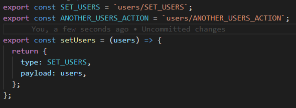
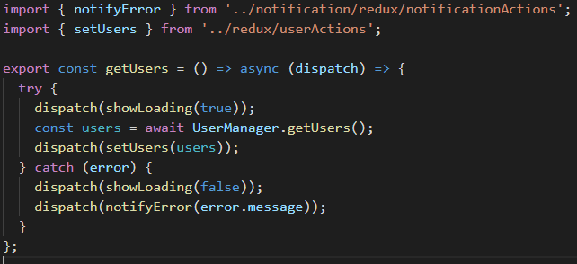
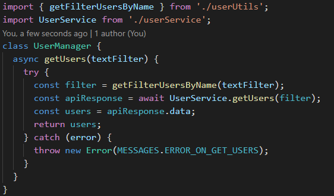

# Proposta estruturação aplicação React+Redux

**OBS.:** A proposta considera uma aplicação react com

## Objetivos

- **Melhorar performance da aplicação**
- **Reduzir tamanho do _bundle_ da aplicação**
- **Potencializar escalabilidade da aplicação**
- **Melhorar usabilidade da aplicação**
- **Melhorar organização de código**
- **Aumentar reuso de código**
- **Reduzir quantidade de testes unitários**
- **Facilitar e dimunuir tempo para manutenibilidade da aplicação**

## 1. Estrutura de pastas/arquivos

- Cenário: estrutura de pasta que agrupa arquivos por tipo
- Isso quer dizer que existe pastas como: containers, components, actions, reducers
- Essas pastas contém arquivos de todos os contextos/funcionalidades do sistema


### 1.1 Estrutura de pastas/arquivos - Problema 1

- Esse tipo de estruturação não é errado, porém o número de arquivos por pasta cresce consideravelmente a medida que criamos novas funcionalidades
- Muitos arquivos gera um sroll grande o que dificulta encontrar e transitar entre arquivos

### 1.2 Estrutura de pastas/arquivos - Problema 2

- Vários níveis de aninhamento de subpasta


- Isso além de dificultar também na transição entre arquivos, dificulta imports relativos de arquivos
- O aninhamento em muitos níveis pode dificultar a transição entre arquivos, mas se ainda sim for desejavel aninhar, a recomendação é de no máximo 3 níveis: [Ver](https://reactjs.org/docs/faq-structure.html#is-there-a-recommended-way-to-structure-react-projects)

### 1.3 Estrutura de pastas/arquivos - Problema 3

- Arquivos correlatos de uma mesma funcionalidade, que geralemente precisam ser modificados em conjunto, ficam muito distantes uns dos outros

### 1.4 Estrutura de pastas/arquivos - Proposta


- Agrupamento de arquivos por features
- Cada feature deve conter todos os arquivos correlatos
- Dentro da pasta da feature havera algumas subpastas e arquivos para separar resposabilidades. Porém não deve haver mas de 2 níveis de aninhamento de subpastas:
  - `pastaFeature/index.js`: não deve conter código. Deve exportar para aplicação somente o que é necessário da _feature_
  - `pastaFeature`: arquivos que não são compoenentes e não são de controle de estado
    - Ex.: **nomeFeature**Service, **nomeFeature**Manager, **nomeFeature**Utils
  - `pastaFeature/redux`: arquivos relacionados a controle de estado(Redux)
    - Ex.: **nomeFeature**Actions, **nomeFeature**Reducer, **nomeFeature**Operations
  - `pastaFeature/views`: Containers e compoentes. Extensão `.JSX`
    - **nomeFeature**Container, **nomeFeature**ComponententUm, **nomeFeature**ComponententDois ...
  - **Testes**: deve haver uma pasta tests para `pastaFeature` e suas respectivas subpastas
- **IMPORTANTE**
- Os arquivos de redux só fazem sentido existir se houer controle de estado para a feature
- Os arquivos Manager, Service só fazem sentido se houver necessidade de comunicação com micro serviços e regras de negócio que implicam nessa comunicação
- **nomeFeature**Utils: funções úteis que só fazem sentido no contexto da feature

## 2. Controle de estado global - Redux

- Redux com responsabilidades que não implicam controle de estado
- Controle de estado, regras de negócio e comunicação com serviço mesclados numa coisa só

### 2.1 Controle de estado global - Redux - Actions - Problema 1

- Actions chamando serviços

  

### 2.2 Controle de estado global - Redux - Actions - Problema 2

- Actions implementando regras de negócio
- Actions tratantando e manipulando dados para enviar para serviços
- Actions tratantando e manipulando respostas de serviços para alterar estado global
  

### 2.3 Controle de estado global - Proposta

- Cada _feature_ terá seu "pedaço" do redux sendo
- `pastaFeature/redux/featureActions`
- `pastaFeature/redux/featureOperations`
- `pastaFeature/redux/featureReducer`
- **featureActions**

  - funções sincronas, atômicas que só retornam uma objeto com _type_ e opcionalmente um _payload_
    ```javascript
    const minhaAction = (parametroOpcional) => {
      return { type: 'TYPE_MINHA_ACTION', payload: true };
    };
    ```
  - Exemplo

    

- **featureReducers**

  - funções para alterar o estado global de acordo com as actions
    ```javascript
    export default (state = INITIAL_STATE, action) => {
      if (action.type === 'TYPE_MINHA_ACTION') {
        return { ...state, value: action.payload };
      }
      return state;
    };
    ```
  - Exemplo

    

- **featureOperations**

  - Existe cenários que a ação do usuário pode resultar em uma chamada de uma função assíncrona
  - Existe cenários que a ação do usuário pode disparar multiplas actions para alterar mais de um estado
  - Nesses cenários, crie **operations**
    ```javascript
    const meuOperation = (parametrosOpcionais) => async (dispatch) => {
      dispatch(minhaAction());
      // await ..alguma promise
      dispatch(outraAction());
    };
    ```
  - Exemplo

    

  - **OBS.:** o **ASYNC** só é obrigatório no _operation_ se ele executar funções assíncronas

### 2.3 Controle de estado global - Proposta

- Arquivos **actions** ou **operations** não devem fazer chamadas de serviço
- Arquivos **actions** ou **operations** não devem implementar regras de negócio sobre comunicação/respostas com serviços

### 3. Responsabilidades

- Como já mencionado não existe uma sepração clara de responsabilidades entre controle de estado, regras de negócio e comunicação com serviços/API

### 3.1 Responsabilidades - Problema

- **Redux** usado para fazendo tudo
- Funções, **actions**, muito grandes, muito complexas
  - Dificil dar manutenção
  - Difícil testar
  - Difícil escalar
  - Difícil reusar

### 3.2 Responsabilidades - Proposta

- **Separar controle de estado de chamadas de serviço**
  - `nomeFeatureService`: chamadas de serviços deverão ser executadas por services
- **Separar controle de estado de regras de negócio**
  - `nomeFeatureManager`: responsável por intermediar controle de estado e service
    - preparar parametros para chamadas da service, quando necessário
    - trata respostas de chamadas de serviços
      - passa o dado já tratado para o controle de estado
    - tratar exceções de chamadas de serviços

### 3.3 Responsabilidades - Proposta - Visão geral: Redux vs Manager vs Service


- **Alteração de estado com Actions - Regras**

  - ações simples
  - atômicas
  - sincronas

- **Alteração de estado com Actions - Fluxo**

  - **featureContainers** ou **featureComponents** chama action
    ```javascript
    const meuComponente = (props) => {
      //..em algum lugar no component/container
      props.minhaAction();
    };
    ```
  - action retorna: type/payload
    ```javascript
    const minhaAction = (parametroOpcional) => {
      return { type: 'TYPE_MINHA_ACTION', payload: true };
    };
    ```
  - reducer altera estado
    ```javascript
    export default (state = INITIAL_STATE, action) => {
      if (action.type === 'TYPE_MINHA_ACTION') {
        return { ...state, value: action.payload };
      }
      return state;
    };
    ```
  - o estado é alterado e os container/components que "escutam" essa alteração recebem o estado alterado via **props**

- **Alteração de estado com Operations - Regras**
  - operações que precisam executar multiplas ações
  - operações assíncronas
- **Alteração de estado com Operations - Fluxo chamada de serviço**

  - **featureContainers** ou **featureComponents** chamam a operação
    ```javascript
    const meuComponente = (props) => {
      //..em algum lugar no component/container
      props.meuOperation();
    };
    ```
  - **featureOperations**
    - comunica com **featureManager**
    - realiza dispatches
    - trata exceção
    ```javascript
    const meuOperation = (parametrosOpcionais) => async (dispatch) => {
      try {
        dispatch(minhaAction());
        const dadosQuePreciso = await featureManager.obtemDados(parametrosOpcionais);
        dispatch(actionIncluiDadoNoRedux(dadosQuePreciso));
      } catch (error) {
        dispatch(actionNotificaErro(error.message));
      }
    };
    ```
  - **featureManager**

    - prepara parametros para requisição
    - chama **featureService**
    - trata resposta ou exceção

    ```javascript
    class FeatureManager {
      async obtemDados(parametrosOpcionais) {
        try {
          const filtro = featureUtils.montaFiltro(parametrosOpcionais);
          const respostaServico = await featureService.obtemDados(filtro);
          let meuDadoTratado = featureUtils.trataMeuDado(resposta.data);
          return meuDadoTratado;
        } catch (error) {
          throw mensagensErro.ERRO_AO_OBTER_MEU_DADO;
        }
      }
    }
    ```

    Exemplo

    

  - **featureService**

    - somente faz a requisição
    - não trata exceção de requisição

    ```javascript
    class FeatureService {
      async obtemDados(filtro) {
        return axios.get(`${URL_SERVICO}/${filtro}`);
      }
    }
    ```

    Exemplo

    

### 3.4 Responsabilidades - Proposta - Dicas

- Existe cenários em que já existe uma service de outra feature que retorna o dado que a feature corrente precisa
- Nesses cenários
  - crie uma função no manager da feature corrente
  - essa função deve conversar com o manager da outra feature para obter o dado desejado

### 4. Performance - Problemas

- Todo o bundle da aplicação carregado em primeiro instante
- Components
  - má componentização
  - class components que podem ser function components
  - components com renderizações desnecessárias
  - duplicação de código em components

### 4.1 Performance - Proposta 1

- Roteamento de components - _code splitting_ - _react-router_
  - geralmente features tem um componente raíz, um componente macro, como um container ou uma **page**
  - rotear não melhora performance, mas facilita implementar _code splitting_ na aplicação
  - o _bundle_ da aplicação é fragmentado em partes menores e estas são carregadas de forma assíncrona e por demanda

### 4.2 Performance - Proposta 2

- Usar técnicas recomendadas pelo **React** para optimizar components e renderizações desnecessárias
  - transformar **class components** em **function components**
    - **components** que não usam **state** e/ou **lifecycle** NÃO precisam ser criados como **class**
    - **function components** são mais performáticos em detrimento a **class components**
    - **IMPORTANTE** caso a versão do react for >= 16.8 use hooks, assim todos os componentes poderão ser **function components**
  - optimizar renderizações
    - existe cenários que **components** são re-renderizados mesmo que os mesmos não sofreram alterações em seu state e/ou props
    - em **class components** isso pode ser evitado implementando o lifecycle **shouldComponentUpdate()**
    - em **function components** isso pode ser evitado usando o **React.memo**

### 4.3 Performance - Proposta 3

- Criar biblioteca de components reusáveis (design system)
  - reduz duplicação de código
  - reduz quantidade e aumenta qualidade de testes unitários de components
  - reduz duplicação de estilização
  - reduz tempo e facilita manutenção
  - **components** reusáveis com renderização optimizada reduz o tempo de renderização de **parent components**
  - reduz o bundle da aplicação

### 5. Sugestões melhorias de Código - React

- Components muito grandes

  - sugestão: no máximo 150 linhas

- Separar **container components** de **presentational components**. [Ver](https://medium.com/@dan_abramov/smart-and-dumb-components-7ca2f9a7c7d0)

- Extraia de componentes mais complexos, partes que podem ser componentizadas em componentes menores, mais simples e possivelmente reusáveis

- Evite estilizar com arquivos **.css**. O proprio react e algumas libs(opcional) possibilitam a estilização de componentes utilizando _css_ no JS.

- Em containers, components, manager, service

  - Não fazer tratamento/validações de dados (map, filter, transformar objetos, etc.)
    - crie funções no arquivo **featureUtils** quando fizer sentido só no contexto da feature
    - crie funções no arquivo **shared/utils** geral quando for uma função que pode ser usada em outros contextos

- Veja mais dicas [aqui](https://www.codeinwp.com/blog/react-best-practices/)

### 5.1 Sugestões melhorias de Código - Geral

- blocos **if/else**

  ```javascript
  // evite condições muito grandes ou muitas condições nos if's
  if (variavelUm === 'bla' && variavelDois[0].valor === 2 && variavelTres.length > 0) {
    // faz alguma coisa
  }

  // Sugestão: associar condições a variáveis com nomes descritivos
  const condicaoUm = variavelUm === 'bla';
  const condicaoDois = variavelDois[0].valor === 2;
  const condicaoTres = variavelTres.length > 0;
  const deveFazerAlgumaCoisa = condicaoUm && condicaoDois && condicaoTres;
  if (deveFazerAlgumaCoisa) {
    // faz alguma coisa
  }
  ```

- Nomes descritivos

  ```javascript
  // Nomes não intuitivos/descritivos
  const idades = [1, 2, 3];
  const filtradas = pessoas.filter((pessoa) => idades.includes(pessoa.idade));

  // Sugestão
  const idadesFiltrar = [1, 2, 3];
  const pessoasFitlradasPorIdade = pessoas.filter((pessoa) => idadesFiltrar.includes(pessoa.idade));
  ```

- Funções com responsabilidade única

  ```javascript
  // Note que a função não está só filtrando as pessoas por idade
  const idadesFiltrar = [1, 2, 3];
  const filtraPessoasPorIdade = (pessoas, idadesFiltrar) => {
    return pessoas
      .filter((pessoa) => idadesFiltrar.includes(pessoa.idade))
      .sort((a, b) => a.idade - b.idade);
  };

  // Sugestão
  const filtraPessoasPorIdade = (pessoas, idadesFiltrar) => {
    return pessoas.filter((pessoa) => idadesFiltrar.includes(pessoa.idade));
  };
  const ordenaPessoasPorIdade = (pessoas) => {
    return pessoas.sort((a, b) => a.idade - b.idade);
  };
  ```

### 5.1 Sugestões melhorias de Código - Geral - Funções puras

- Uma função é dita pura se ela atende minimamente dois requisitos

  - Ela não causa efeitos colaterais como alterar algo fora do seu escopo

  ```javascript
  // Função impura - Causa efeito colateral altereando uma variável fora de seu escopo
  let contador = 0;
  const incrementaContador = (val) => {
    return (contador += val); // note que depois dessa linha o contador não será mais 0
  };

  // Sugestão
  let contador = 0;
  const incrementaContador = (val) => {
    const contadorIncrementado = contador + val;
    return contadorIncrementado;
  };
  ```

  - Ela sempre retorna o mesma coisa dado um mesmo parâmentro

  ```javascript
  // Função impura - Não retorna o mesmo valor dado o mesmo parâmetro
  let valor = 0;
  // ..codigos
  // não podemos garantir que essa função sempre retorna o mesmo resultado
  // porque ela usa "coisas" de fora que podem ser alterados
  const valorMaiorQueZero = () => {
    return valor > 0;
  };

  // Sugestão - Passar parâmetro
  const valorMaiorQueZero = (valorAvaliar) => {
    return valorAvaliar > 0;
  };
  ```

### 5.1 Sugestões melhorias de Código - Geral - Aberto/Fechado ou Generalização/Especialização

- O conceito aberto/fechado nos príncipios do SOLID em POO é uma classe aberta para extentesão, mas fechada para alterações
- Em JS podemos criar funções mais genéricas e extender seu uso/comportamento criando funções especializadas que usam as genéricas em diferentes contextos

  - assim não precisamos alterar as funções mais genéricas para uso em diferentes contextos

  ```javascript
  // As vezes repetimos uma lógica que pode ser generalizada aplicando aberto/fechado
  const pessoas = [
    { nome: 'a', idade: 1 },
    { nome: 'b', idade: 2 },
  ];
  const trataArrayPessoas = (pessoas) => {
    const pessoasComDezoitoAnos = pessoas.filter((pessoa) => pessoa.idade === 18);
    const pessoasFiltradasPorNome = pessoasComDezoitoAnos.filter((pessoa) => pessoa.nome === 'a');
  };

  // Sugestão
  const trataArrayPessoas = (pessoas) => {
    const pessoasComDezoitoAnos = filtraObjetosPorPropriedade(pessoas, 'idade', 18);
    const pessoasFiltradasPorNome = filtraObjetosPorPropriedade(pessoas, 'nome', 'a');
  };

  // note que o comportamento da função pode ser extendido
  // sem a necessidade de alterar a função para cada contexto
  const filtraObjetosPorPropriedade = (objetos, propriedade, valor) => {
    const objetosFiltrados = objetos.filter((objeto) => objeto[propriedade] === valor);
  };
  ```

### 5.1 Sugestões melhorias de Código - Geral - Encapsulamento

- Encapsular uso de packages de terceiros

  ```javascript
  // Isolar uso de bibliotecas te terceiros
  // usando lodash
  const pessoasComDezoitoAnos = _.filter(pessoas, { idade: 18 });

  // Sugestão
  const filtrapessoasComDezoitoAnos = (pessoas) => {
    return _.filter(pessoas, { idade: 18 });
  };
  ```
